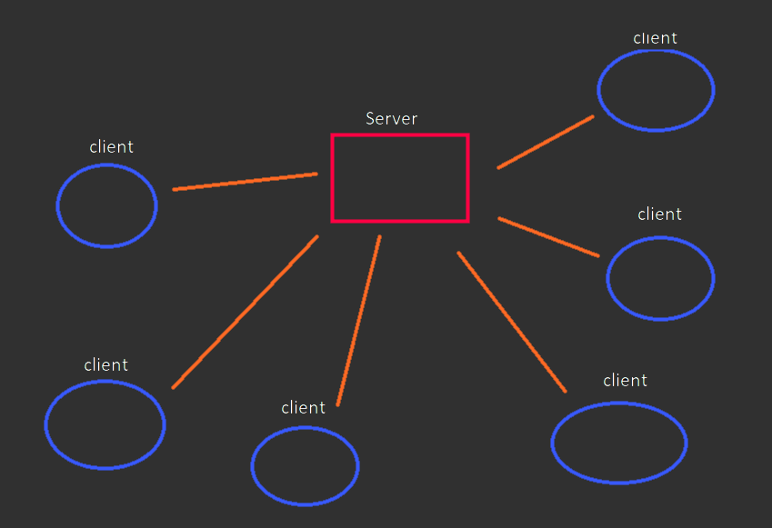
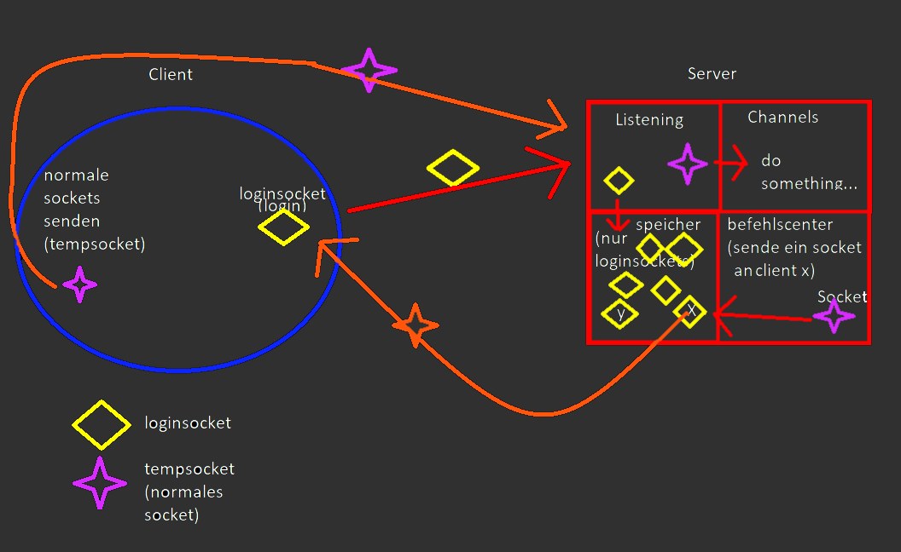

# Die gute alte Socket API
made with Eclipse

Die Api ist dafür gemacht um eine stabile Verbindung mit auto reconnect zwischen einem Server und vielen Clients aufzubauen. Ein Anwendungs-Beispiel wäre ein IRC Chat innerhalb eines Minecraft Clients zwischen anderen Benutzern des Minecraft Clients.

Was ihr damit macht ist euere Sache.

## Version 1.4

## Code Beispiel für den Socket Client:
```java
Manager m = new Manager();
m.setName(temp);
m.start();

m.sendDataPackage(new DataPackage("MSG", IDHelper.getEncodedID(), "Hello World!"));
```



